Gam and Tree Models
================
Zoe Buck

``` r
set.seed(27787)
```

## Simulation exercise

### Data generation

``` r
num_observations <- 1000
num_variables = 3  

# Generate 2 numeric variables with random values                         
x1 <- runif(1000)
x2 <- runif(1000)
                                                                                                                                   
# Combine these variables into a data frame
df <- data.frame(x1, x2)
                                                                                                                                                                                  
# Generate a categorical variable with random categories
cat_var <- sample(c('A', 'B', 'C'), 1000, replace = TRUE)

# Add categorical variable to the data frame
df$cat_var <- cat_var
                                                                                                                                 
                  
  # Check the first few rows of the data frame
  head(df)  
```

    ##          x1        x2 cat_var
    ## 1 0.1821608 0.7546007       B
    ## 2 0.6775761 0.0991291       C
    ## 3 0.8655066 0.1876692       B
    ## 4 0.9815484 0.1192167       A
    ## 5 0.2847198 0.3445697       A
    ## 6 0.3263922 0.3549669       B

``` r
# CEF
f1 <- function(x1) 1/2 + x1^4/2 
f2 <- function(x2) sin(pi*x2) 
f3 <- function(x1, x2) 1 + x1^3 + x2^4


CEF <- function(num_var1, num_var2, cat_var1) {
  if_else(cat_var1 == "A",
          # first case
          1/2 + num_var1^4/2,
          ifelse(cat_var1 == "B",
                 # second case
                 sin(pi*x2),
                 # last case
                 1 + num_var1^3 + num_var2^4
                 )
         )
}
training_data <- df |> mutate(y = CEF(x1, x2, cat_var) + rnorm(num_observations, sd = .5))
training_data <- training_data |> mutate(y = y - mean(y)) # center outcome

#simple scatterplot of data
ggplot(training_data, aes(x1, y, color=cat_var)) + geom_point(alpha = .7)
```

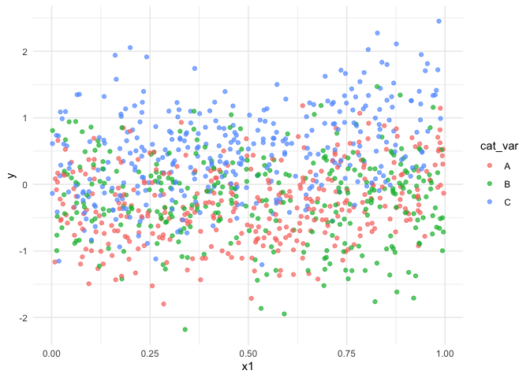<!-- -->

``` r
ggplot(training_data, aes(x2, y, color=cat_var)) + geom_point(alpha = .7)
```

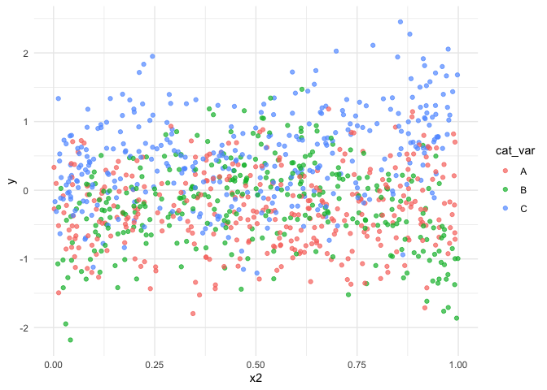<!-- -->

``` r
#visualization of data and interactions
training_data %>% 
  gather(variable, value, x1, x2) %>% 
  ggplot(aes(x=value, y=y)) +
  geom_smooth(aes(group=cat_var, colour=cat_var)) +
  facet_grid(cat_var~variable, scales ="free")
```

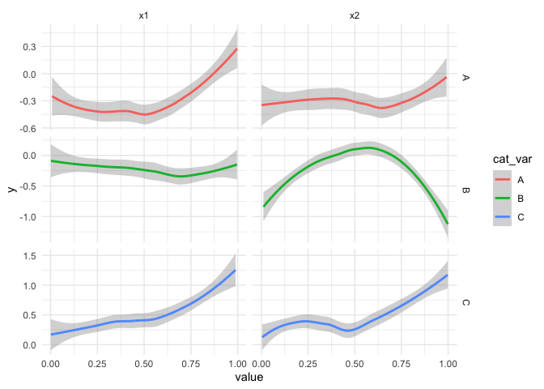<!-- -->

### Additive models

``` r
library(gam)
library(mgcv)
library(gratia)

#need to have categorical variable as a factor for gam function
training_data$cat_var <- factor(training_data$cat_var)

print("Gam Simple")
```

    ## [1] "Gam Simple"

``` r
#Creating a gam model with no interaction terms
gam_simple <- gam(y ~ s(x1) + s(x2) + cat_var, data = training_data)
gam_simple
```

    ## 
    ## Family: gaussian 
    ## Link function: identity 
    ## 
    ## Formula:
    ## y ~ s(x1) + s(x2) + cat_var
    ## 
    ## Estimated degrees of freedom:
    ## 6.23 3.10  total = 12.33 
    ## 
    ## GCV score: 0.3534378

``` r
print("Gam with Interactions")
```

    ## [1] "Gam with Interactions"

``` r
#Creating a gam model with interactions (as exists in the true CEF)
gam_oracle <- gam(y ~ s(x1) + s(x2) + s(x1, by = cat_var) + s(x2, by=cat_var) + cat_var, data = training_data)
gam_oracle
```

    ## 
    ## Family: gaussian 
    ## Link function: identity 
    ## 
    ## Formula:
    ## y ~ s(x1) + s(x2) + s(x1, by = cat_var) + s(x2, by = cat_var) + 
    ##     cat_var
    ## 
    ## Estimated degrees of freedom:
    ## 6.57 0.75 1.20 1.27 0.75 3.99 3.25 
    ## 6.57  total = 27.34 
    ## 
    ## GCV score: 0.2852142     rank: 73/75

\###Visualizations for gam_simple

``` r
library(mgcViz)
library(gridExtra)

b <- getViz(gam_simple)
#simple plot using mgcViz package showing all variables
print(plot(b, allTerms = T), pages = 1)
```

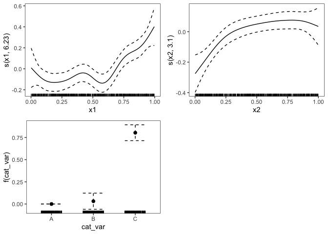<!-- -->

``` r
#density maps 
density1 <- plot(sm(b, 1)) + l_dens(type = "cond") + l_rug()
density2 <- plot(sm(b, 2)) + l_dens(type = "cond") + l_rug()

#list side by side
ml <- list(density1[["ggObj"]], density2[["ggObj"]])
grid.arrange(grobs = ml, ncol = 2)
```

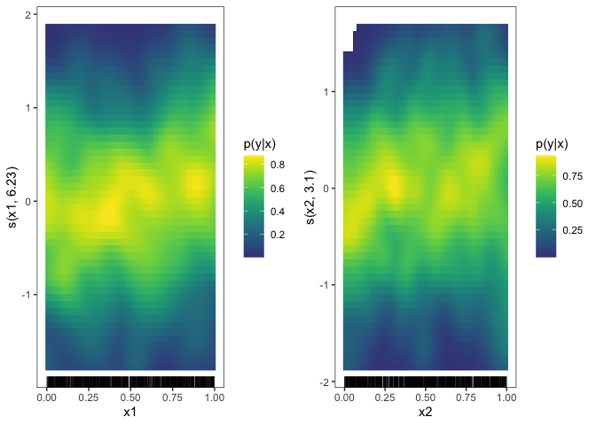<!-- -->

``` r
#Below I added the fitted smooth effect, rugs on the x and y axes, confidence lines at 5 standard deviations, and partial residual points for x1 and x2
pl1 <- plot(sm(b, 1)) + l_fitLine(colour = "blue") + 
    l_ciLine(mul = 5, colour = "red", linetype = 2) + 
    l_points(shape = 19, size = .7, alpha = 0.5, colour="orange") + theme_classic()

pl2 <- plot(sm(b, 2)) + l_fitLine(colour = "blue") + 
    l_ciLine(mul = 5, colour = "red", linetype = 2) + 
    l_points(shape = 19, size = .7, alpha = 0.5, colour="orange") + theme_classic()
# Plot side by side
ml <- list(pl1[["ggObj"]], pl2[["ggObj"]])
grid.arrange(grobs = ml, ncol = 2)
```

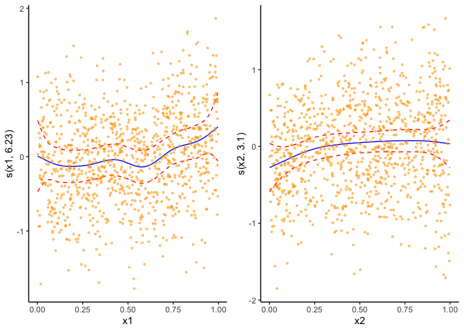<!-- -->

``` r
#3D visualizations at two different angles
pl3 <- vis.gam(gam_simple, theta = 50, n.grid = 10, lwd = 0.4)
```

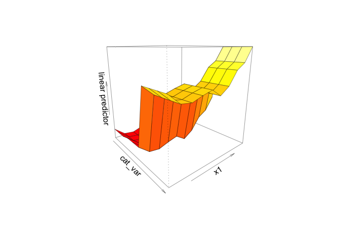<!-- -->

``` r
pl4 <- vis.gam(gam_simple, theta = 250, n.grid = 10, lwd = 0.4)
```

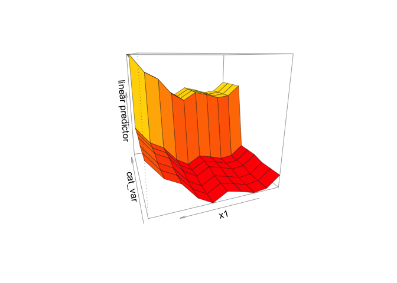<!-- -->
\###Visualizations for gam_oracle

``` r
#simple plot using mgcViz package showing all variables
c <- getViz(gam_oracle)
print(plot(c, allTerms = T), pages = 1)
```

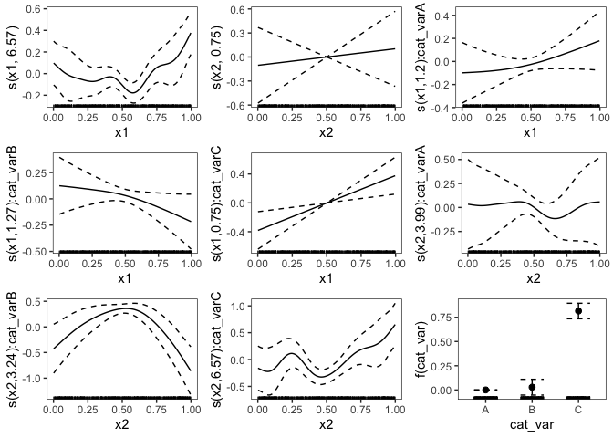<!-- -->

``` r
#density maps 
density3 <- plot(sm(b, 1)) + l_dens(type = "cond") + l_rug()
density4 <- plot(sm(b, 2)) + l_dens(type = "cond") + l_rug()

#list side by side
ml <- list(density3[["ggObj"]], density4[["ggObj"]])
grid.arrange(grobs = ml, ncol = 2)
```

<!-- -->

``` r
plot1 <- plot(sm(c, 1)) + l_fitLine(colour = "blue") + 
    l_ciLine(mul = 5, colour = "red", linetype = 2) + 
    l_points(shape = 19, size = .7, alpha = 0.5, colour="orange") + theme_classic()

plot2 <- plot(sm(c, 2)) + l_fitLine(colour = "blue") + 
    l_ciLine(mul = 5, colour = "red", linetype = 2) + 
    l_points(shape = 19, size = .7, alpha = 0.5, colour="orange") + theme_classic()

# Two plots side by side
ml <- list(plot1[["ggObj"]], plot2[["ggObj"]])
grid.arrange(grobs = ml, ncol = 2)
```

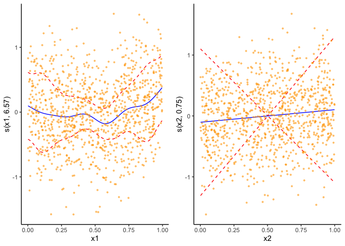<!-- -->

``` r
#3D plot at two different angles
plot3 <- vis.gam(gam_oracle, theta = 50, n.grid = 10, lwd = 0.4)
```

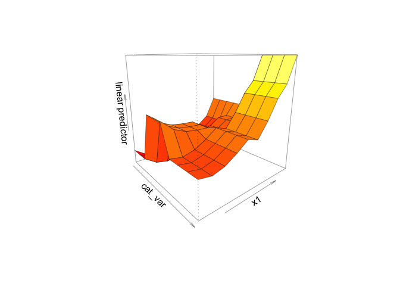<!-- -->

``` r
plot4 <- vis.gam(gam_oracle, theta = 250, n.grid = 10, lwd = 0.4)
```

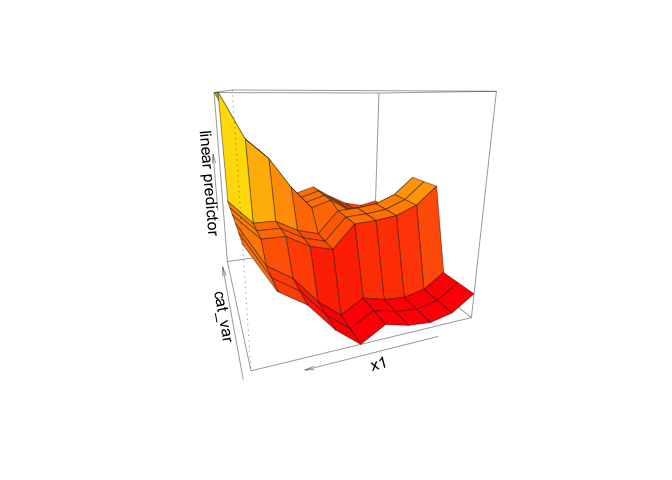<!-- -->

### Tree based models

### Single Tree

``` r
#single tree
library(tree)
library(rattle) # for "weather" dataset and for "fancy" tree plotter

# grow tree with rpart
library(rpart)
#fit <- rpart(y ~ f1(x1) + f2(x2) + f3(x1, x2) + cat_var, data= training_data, method="anova")
fit <- rpart(y ~ x1 + x2 + cat_var, data= training_data, method="anova")

training_data$cat_var <- factor(training_data$cat_var)

fit_tree <- tree(y ~ .,
                 split = "gini",
                 control = tree.control(nrow(training_data)),
                 data = training_data)

# visualize tree with rattle
fancyRpartPlot(fit)
```

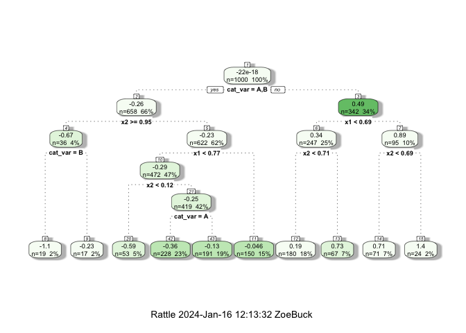<!-- -->

``` r
#printcp(fit) # display the results
plotcp(fit) # visualize cross-validation results
```

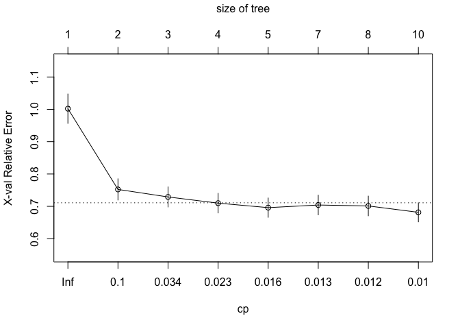<!-- -->

``` r
#summary(fit) # detailed summary of splits


# prune by returning the value in the column of fit$cptable (a table)
# corresponding to the row that has the minimum "xerror" value
tree_pruned <- prune(fit, cp=fit_tree$cptable[which.min(fit_tree$cptable[,"xerror"]),"CP"]) # from cptable   

# visualize pruned tree to check difference
fancyRpartPlot(tree_pruned)
```

<!-- --> I select
a tree size that minimizes the cross-validated error, the xerror column
given by printcp(). It turns out that this produces the same tree as the
original.

\###Random Forest

``` r
#initialize reprtree package to visualize a sample tree from the forest
#used in the code chank below

options(repos='http://cran.rstudio.org')
have.packages <- installed.packages()
cran.packages <- c('devtools','plotrix','randomForest','tree')
to.install <- setdiff(cran.packages, have.packages[,1])
if(length(to.install)>0) install.packages(to.install)

library(devtools)
if(!('reprtree' %in% installed.packages())){
   install_github('munoztd0/reprtree')
}
for(p in c(cran.packages, 'reprtree')) eval(substitute(library(pkg), list(pkg=p)))

#source: https://stats.stackexchange.com/questions/41443/how-to-actually-plot-a-sample-tree-from-randomforestgettree
```

``` r
library(party)
library(randomForest)
library(Hmisc)


#create initial model
fit_rf <- randomForest(y ~ ., ntree = 500, data = training_data)
plot(fit_rf)
```

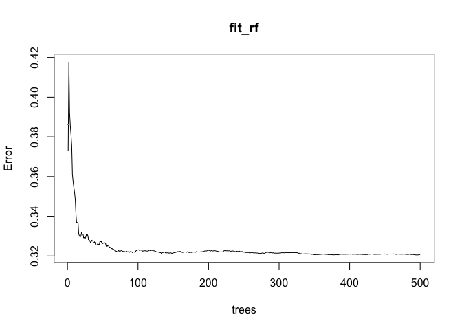<!-- -->

``` r
#finding the number of trees with lowest MSE
which.min(fit_rf$mse)
```

    ## [1] 494

``` r
## [1] 316

# RMSE of this optimal random forest
sqrt(fit_rf$mse[which.min(fit_rf$mse)])
```

    ## [1] 0.5661337

``` r
## [1] 0.5374921

#create a new random forest with the optimal number of trees
rf_pruned <- randomForest(y ~ ., ntree = 316, data = training_data)
plot(rf_pruned)
```

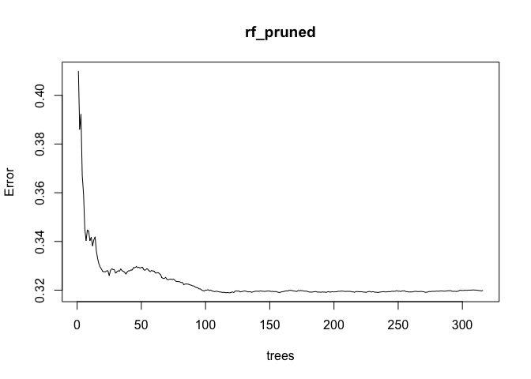<!-- -->

``` r
#visualize a sample from the pruned forest
library(reprtree)
reprtree:::plot.getTree(rf_pruned)
```

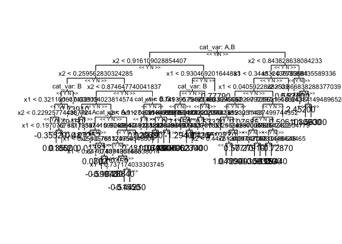<!-- --> Note
that the visualization is messy because of the size, but I was unable to
find a better way to visualize the forest

After addressing the number of trees in the model I can also adjust the
mtry value in my random forest

``` r
predictors <- setdiff(names(training_data), "y")

#find optimal mtry by Select mtry value with minimum out of bag(OOB) error.
mtry <- tuneRF(training_data[predictors],training_data$y, ntreeTry=316, 
               stepFactor=1.5,improve=0.01, trace=FALSE, plot=TRUE)
```

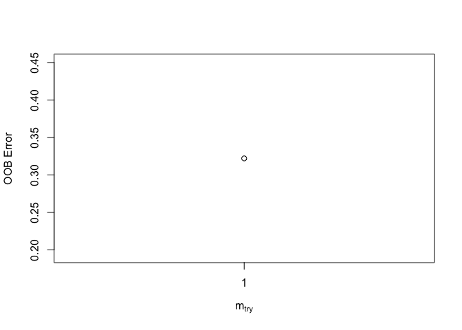<!-- -->

``` r
print(mtry)
```

    ##   mtry OOBError
    ## 1    1 0.322077

It turns out the best mtry value is 1. I know this because the function
does not show any other options which means the other options would lead
to an improvement less than .01 in reduced error. Since mtry represents
the number of variables to randomly sample as candidates at each split,
1 means that the split variable is totally random. The benefit of this
is that all variables will be used but it can lead to overly biased
results.

``` r
#Build model again using best mtry value. mtry represents the number of variables to randomly sample as candidates at each split
fit_rf2 <- randomForest(y ~ ., ntree = 316, data = training_data, mtry=1)
print(fit_rf2)
```

    ## 
    ## Call:
    ##  randomForest(formula = y ~ ., data = training_data, ntree = 316,      mtry = 1) 
    ##                Type of random forest: regression
    ##                      Number of trees: 316
    ## No. of variables tried at each split: 1
    ## 
    ##           Mean of squared residuals: 0.3212921
    ##                     % Var explained: 36.25

``` r
#Evaluate variable importance
fit_rf2$importance
```

    ##         IncNodePurity
    ## x1           59.82745
    ## x2           66.92863
    ## cat_var     136.39430

``` r
varImpPlot(fit_rf2)
```

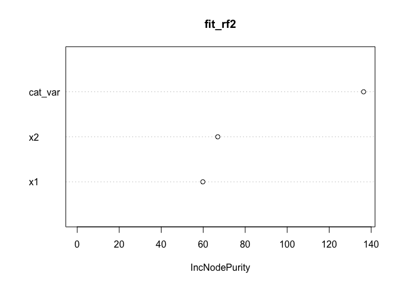<!-- --> Looking
at the impact of the variables, the categorical variable is the most
important while x1 is the least important. This makes sense since x1 has
a smaller impact on the function when the categorical variable is “c”.

\###Boosted Trees

``` r
library(gbm)
library(dplyr)    
library(h2o)      
library(xgboost) 

#I keep the default learning rate of .1, which is relatively high and suitable for this sized data
#Note that the function below is a bit slow because of this
boosted_model = gbm(y ~ ., 
                    data = training_data,
                    distribution = "gaussian",
                    n.trees = 5000,
                    shrinkage = 0.1,
                    interaction.depth = 3,
                    n.minobsinnode = 10,
                    cv.folds = 10)
#boosted_model
#summary(boosted_model)

#Find index for number trees with minimum CV error for this learning rate
best <- which.min(boosted_model$cv.error)

# get MSE and compute RMSE
sqrt(boosted_model$cv.error[best])
```

    ## [1] 0.552187

``` r
#[1] 0.5603756
```

``` r
# plot error curve
gbm.perf(boosted_model, method = "cv")
```

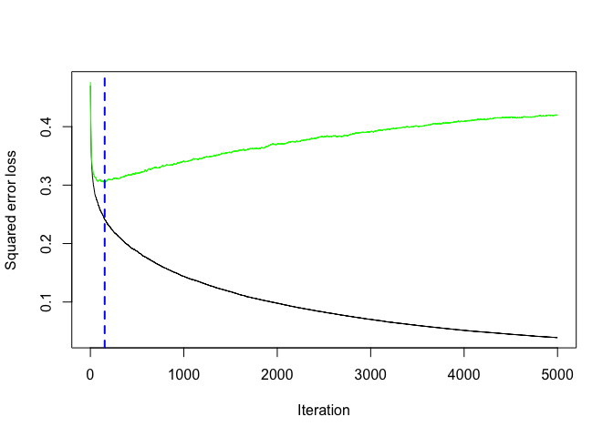<!-- -->

    ## [1] 153

``` r
#The plot shows training and cross-validated MSE in response to the addition of n trees
```

Next I will try and find the parameters that find the best balence
between speed and performance

``` r
# create grid search
hyper_grid <- expand.grid(
  learning_rate = c(0.5, 0.1, 0.05, 0.01, 0.005),
  RMSE = NA,
  trees = NA,
  time = NA
)

# execute grid search
for(i in seq_len(nrow(hyper_grid))) {

  # fit gbm
  train_time <- system.time({
    boosted_model <- gbm(
      formula = y ~ .,
      data = training_data,
      distribution = "gaussian",
      n.trees = 5000, 
      shrinkage = hyper_grid$learning_rate[i], 
      interaction.depth = 3, 
      n.minobsinnode = 10,
      cv.folds = 10 
   )
  })
  
  #add SSE, trees, and training time to results
  hyper_grid$RMSE[i]  <- sqrt(min(boosted_model$cv.error))
  hyper_grid$trees[i] <- which.min(boosted_model$cv.error)
  hyper_grid$Time[i]  <- train_time[["elapsed"]]

}

# results
arrange(hyper_grid, RMSE)
```

    ##   learning_rate      RMSE trees time  Time
    ## 1         0.010 0.5534197  1167   NA 9.313
    ## 2         0.005 0.5535166  2698   NA 9.526
    ## 3         0.100 0.5554196    93   NA 9.454
    ## 4         0.050 0.5598637   320   NA 9.379
    ## 5         0.500 0.5713315    10   NA 9.355

The RMSE is smallest when the learning rate is .05, and since the time
that takes is not much longer than other options I will that as the
learning rate. Next, I will tune the hyperparameters of
interaction.depth and n.minobsinnode.

``` r
# create search grid
hyper_grid <- expand.grid(
  n.trees = 6000,
  shrinkage = 0.01,
  interaction.depth = c(3, 5, 7),
  n.minobsinnode = c(5, 10, 15)
)

# define the model
model_fit <- function(n.trees, shrinkage, interaction.depth, n.minobsinnode) {
  boosted_model <- gbm(
    formula = y ~ .,
    data = training_data,
    distribution = "gaussian",
    n.trees = n.trees,
    shrinkage = shrinkage,
    interaction.depth = interaction.depth,
    n.minobsinnode = n.minobsinnode,
    cv.folds = 10
  )
  # calculate RMSE
  sqrt(min(boosted_model$cv.error))
}

# perform search grid
hyper_grid$rmse <- purrr::pmap_dbl(
  hyper_grid,
  ~ model_fit(
    n.trees = ..1,
    shrinkage = ..2,
    interaction.depth = ..3,
    n.minobsinnode = ..4
    )
)

# results
arrange(hyper_grid, rmse)
```

    ##   n.trees shrinkage interaction.depth n.minobsinnode      rmse
    ## 1    6000      0.01                 7             15 0.5516277
    ## 2    6000      0.01                 5             15 0.5524718
    ## 3    6000      0.01                 7             10 0.5534753
    ## 4    6000      0.01                 7              5 0.5538833
    ## 5    6000      0.01                 3              5 0.5542219
    ## 6    6000      0.01                 3             15 0.5542722
    ## 7    6000      0.01                 5             10 0.5551993
    ## 8    6000      0.01                 5              5 0.5561297
    ## 9    6000      0.01                 3             10 0.5573200

I find that the interaction.depth and n.minobsinnode minimizing the rmse
are 7 and 15 respectively. Creating a final model with these
specifications produces these results:

``` r
boosted_model_final = gbm(y ~ ., 
                    data = training_data,
                    distribution = "gaussian",
                    n.trees = 5000,
                    shrinkage = 0.05,
                    interaction.depth = 7,
                    n.minobsinnode = 15,
                    cv.folds = 10)
boosted_model_final
```

    ## gbm(formula = y ~ ., distribution = "gaussian", data = training_data, 
    ##     n.trees = 5000, interaction.depth = 7, n.minobsinnode = 15, 
    ##     shrinkage = 0.05, cv.folds = 10)
    ## A gradient boosted model with gaussian loss function.
    ## 5000 iterations were performed.
    ## The best cross-validation iteration was 96.
    ## There were 3 predictors of which 3 had non-zero influence.

``` r
#Showing a summary of the final model
summary(boosted_model_final)
```

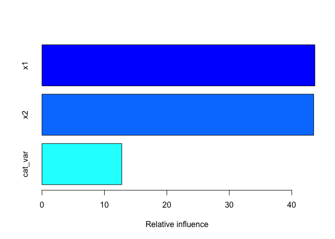<!-- -->

    ##             var  rel.inf
    ## x1           x1 43.70834
    ## x2           x2 43.51081
    ## cat_var cat_var 12.78085

### ID generalisation

``` r
set.seed(27787)

# Generate test numeric variables with random values                         
x1_test <- runif(1000)
x2_test <- runif(1000)
                                                                                                                                   
# Combine these variables into a data frame
df_test <- data.frame(x1_test, x2_test)
                                                                                                                                                                                  
# Generate 4 categorical variables with random categories
cat_var_test <- sample(c('A', 'B', 'C'), 1000, replace = TRUE)

  # Add these variables to the data frame
df_test$cat_var_test <- cat_var_test
test_data <- df |> mutate(y = CEF(x1_test, x2_test, cat_var_test) + rnorm(num_observations, sd = .5))
```

``` r
#testing 
library(caret)
# predicting the target variable
test_data$cat_var <- factor(test_data$cat_var)
predictions <- predict(tree_pruned, test_data)

# computing single tree model performance metrics
single_tree <- data.frame( R2 = R2(predictions, test_data$y),
            RMSE = RMSE(predictions, test_data$y),
            MAE = MAE(predictions, test_data$y))

single_tree
```

    ##          R2     RMSE       MAE
    ## 1 0.4001594 1.059485 0.9271298

``` r
#compute random forest performance metrics
RFpredictions <- predict(fit_rf2, test_data)
rand_forest <- data.frame( R2 = R2(RFpredictions, test_data$y),
            RMSE = RMSE(RFpredictions, test_data$y),
            MAE = MAE(RFpredictions, test_data$y))
rand_forest
```

    ##          R2    RMSE       MAE
    ## 1 0.5861858 1.02317 0.9143319

``` r
BoostedPredictions <- predict(boosted_model_final, test_data)
boosted <- data.frame( R2 = R2(BoostedPredictions, test_data$y),
            RMSE = RMSE(BoostedPredictions, test_data$y),
            MAE = MAE(BoostedPredictions, test_data$y))
boosted
```

    ##         R2     RMSE       MAE
    ## 1 0.518842 1.035558 0.9207486

The random forest has the lowest RMSE out of all three models and the
highest R2. Therefor I will be using the random forest model going
forward.

### OOD generalisation

#### Covariate shift

**Better Model**

``` r
set.seed(27787)
# Generate test numeric variables with random values  
#Note that I have changed the distribution of x1 and x2 by taking the square root of the generated values. Everything else is the same
x1_test <- sqrt(runif(1000))
x2_test <- sqrt(runif(1000))
                                                                                                                                   
# Combine these variables into a data frame
df_test <- data.frame(x1_test, x2_test)
                                                                                                                               
# Generate 4 categorical variables with random categories
cat_var_test <- sample(c('A', 'B', 'C'), 1000, replace = TRUE)

  # Add these variables to the data frame
df_test$cat_var_test <- cat_var_test
test_data <- df |> mutate(y = CEF(x1_test, x2_test, cat_var_test) + rnorm(1000, sd = .5))


#Workaround to bug in predict.randomForest telling me the test data was not the same as the training data
test_data <- rbind(training_data[1, ] , test_data)
    test_data <- test_data[-1,]

#Test impact on forest model
RFpredictions <- predict(fit_rf2, test_data)
rand_forest <- data.frame( R2 = R2(RFpredictions, test_data$y),
            RMSE = RMSE(RFpredictions, test_data$y),
            MAE = MAE(RFpredictions, test_data$y))
rand_forest
```

    ##          R2     RMSE     MAE
    ## 1 0.6813796 1.139667 1.02908

``` r
#.58
```

By changing the distribution of x1 and x2 by taking the square root of
generated values, I am able to increase the R2 from .58 to .68. At first
I only took the square root of x1 which increased the R2 to .65. Then by
taking the square root of both variables I was able to increase the R2
more. This is likely because in taking the square root I am more
dramatically decreasing larger values than smaller values. In that way I
am normalizing the generated values. The RMSE increases slightly (by
.1), which also makes sense since some of the values are being shifted.

Another option to increase the R2 is also to simply reduce the sd (which
is currently at .5). However I was more surprised by the sqrt effect so
I decided to leave that one above.

**Worse Model **

``` r
set.seed(27787)
# Generate test numeric variables with random values  
#Note that I have changed the distribution of x1by taking the log of the generated values. Everything else is the same
x1_test <- log(runif(1000)) 
x2_test <- runif(1000)
                                                                                                                                   
# Combine these variables into a data frame
df_test <- data.frame(x1_test, x2_test)
                                                                                                                               
# Generate 4 categorical variables with random categories
cat_var_test <- sample(c('A', 'B', 'C'), 1000, replace = TRUE)

  # Add these variables to the data frame
df_test$cat_var_test <- cat_var_test
test_data <- df |> mutate(y = CEF(x1_test, x2_test, cat_var_test) + rnorm(1000, sd = .5))


#Workaround to bug in predict.randomForest telling me the test data was not the same as the training data
test_data <- rbind(training_data[1, ] , test_data)
    test_data <- test_data[-1,]

#Test impact on forest model
RFpredictions <- predict(fit_rf2, test_data)
rand_forest <- data.frame( R2 = R2(RFpredictions, test_data$y),
            RMSE = RMSE(RFpredictions, test_data$y),
            MAE = MAE(RFpredictions, test_data$y))
rand_forest
```

    ##           R2     RMSE      MAE
    ## 1 0.02152703 22.07397 5.081136

``` r
#.58 1.02
```

By taking the log of x1 generated values has a dramatic effect on R2 and
RMSE: R2 decreases by .56 and RMSE increases by 21.05. It probably gets
worse because the log will pull the distribution to the left, while the
random forest is currently trained on a more Gaussian/normal
distribution.

#### Concept shift

**Better Model**

``` r
set.seed(27787)

#Note I have edited the last case so num_var1 is raised to the second power instead of the 3rd power. I Also remove "+.5" from the first case
CEF <- function(num_var1, num_var2, cat_var1) {
  if_else(cat_var1 == "A",
          # first case
          num_var1^4/2,
          ifelse(cat_var1 == "B",
                 # second case
                 sin(x2 * pi),
                 # last case
                 1 + num_var1^2 + num_var2^4
                 )
         )
}

# Generate test numeric variables with random values  
x1_test <- runif(1000)
x2_test <- runif(1000)
                                                                                                                                   
# Combine these variables into a data frame
df_test <- data.frame(x1_test, x2_test)
                                                                                                                               
# Generate 4 categorical variables with random categories
cat_var_test <- sample(c('A', 'B', 'C'), 1000, replace = TRUE)

  # Add these variables to the data frame
df_test$cat_var_test <- cat_var_test
test_data <- df |> mutate(y = CEF(x1_test, x2_test, cat_var_test) + rnorm(1000, sd = .5))


#Workaround to bug in predict.randomForest telling me the test data was not the same as the training data
test_data <- rbind(training_data[1, ] , test_data)
    test_data <- test_data[-1,]

#Test impact on forest model
RFpredictions <- predict(fit_rf2, test_data)
rand_forest <- data.frame( R2 = R2(RFpredictions, test_data$y),
            RMSE = RMSE(RFpredictions, test_data$y),
            MAE = MAE(RFpredictions, test_data$y))
rand_forest
```

    ##          R2     RMSE       MAE
    ## 1 0.6952014 0.938714 0.8016269

``` r
#.58 1.02
```

I have edited the last case so num_var1 is raised to the second power
instead of the 3rd power. I also removed “+.5” from the first case. This
caused R2 to increase by .1 and RMSE to decrease by .1. I think this
improved the model because in the third case, the model might have been
mostly taking into account the impact of num_var2 since that has a
larger impact (being to the 5th power). Thus deceasing the effect of
num_var2 more closely aligns with the model’s focus on num_var2. The
additional .5 in the first case might have been adding more noise to the
data that the model didn’t pick up on so removing it reduced error.

**Worse Model**

``` r
set.seed(27787)

#Note I have edited the second case by adding 2
CEF <- function(num_var1, num_var2, cat_var1) {
  if_else(cat_var1 == "A",
          # first case
          .5 + num_var1^4/2,
          ifelse(cat_var1 == "B",
                 # second case
                 2 + sin(x2 * pi),
                 # last case
                 1 + num_var1^3 + num_var2^4
                 )
         )
}

# Generate test numeric variables with random values  
x1_test <- runif(1000)
x2_test <- runif(1000)
                                                                                                                                   
# Combine these variables into a data frame
df_test <- data.frame(x1_test, x2_test)
                                                                                                                               
# Generate 4 categorical variables with random categories
cat_var_test <- sample(c('A', 'B', 'C'), 1000, replace = TRUE)

  # Add these variables to the data frame
df_test$cat_var_test <- cat_var_test
test_data <- df |> mutate(y = CEF(x1_test, x2_test, cat_var_test) + rnorm(1000, sd = .5))


#Workaround to bug in predict.randomForest telling me the test data was not the same as the training data
test_data <- rbind(training_data[1, ] , test_data)
    test_data <- test_data[-1,]

#Test impact on forest model
RFpredictions <- predict(fit_rf2, test_data)
rand_forest <- data.frame( R2 = R2(RFpredictions, test_data$y),
            RMSE = RMSE(RFpredictions, test_data$y),
            MAE = MAE(RFpredictions, test_data$y))
rand_forest
```

    ##           R2     RMSE      MAE
    ## 1 0.04207597 1.858772 1.547875

``` r
#.58 1.02
```

Adding two to the second case equation has reduced R2 by .54 and
increased RMSE by .83. I think the shift of adding two had such a
dramatic effect on the R2 because now around a third of the data points
are going to on average about 2 units off from where they are expected
to be.
